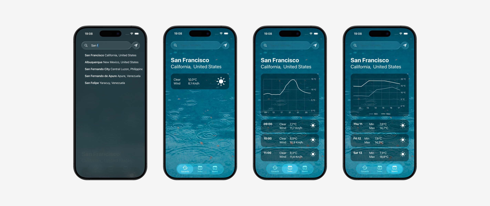
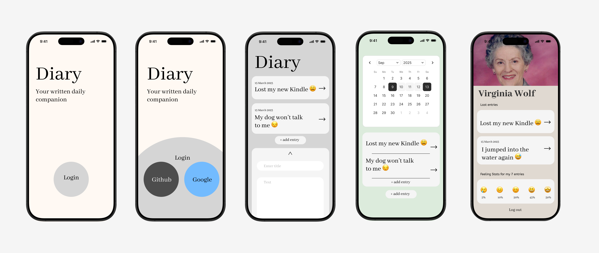

# Swift Piscine Projects

This repository showcases a collection of iOS applications built with **SwiftUI**, demonstrating a progression from basic UI layout to complex networking and authentication. The focus is on clean architecture, modern concurrency patterns, and third-party integrations.

---

## 1. Calculator (Logic & MVVM)
**Project**: `calculator_app`

A functional calculator app built to demonstrate strict separation of concerns.

*   **Architecture**: Uses **MVVM** (Model-View-ViewModel) to decouple the calculation logic from the view layer.
*   **UI Construction**: Layout built with nested `HStack` and `VStack` components.
*   **State Management**: Utilizes `@Published` properties for reactive UI updates.

---

## 2. Weather App (Networking & Concurrency)
**Project**: `medium_weather_app` / `advanced_weather_app`

A location-based weather application that fetches real-time data.

*   **Networking**: Implements **Async/Await** for non-blocking API requests to OpenMeteo.
*   **Data Parsing**: Uses `Codable` structs to safely parse JSON responses.
*   **Location Services**: Integrates `CoreLocation` to access device GPS coordinates and handle permission flows.

---

## 3. Diary App (Auth & Persistence)
**Project**: `diary_app`

A secure notes application featuring user accounts and cloud integration.

*   **Authentication**: Implements **Firebase Auth** with OAuth providers (Google & GitHub).
*   **Reactive Flow**: Uses `Combine` listeners to manage authentication state and route users.
*   **Storage**: Securely manages user sessions and data persistence.

---

## Tech Stack Overview

| Category | Technologies |
| :--- | :--- |
| **UI** | SwiftUI, UIKit Integration |
| **Architecture** | MVVM |
| **Concurrency** | Async/Await, Combine |
| **Networking** | URLSession, REST APIs |
| **Backend** | Firebase Auth, OAuth |
| **Core** | CoreLocation |
